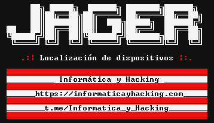

# jager
<strong>Obtener la ubicación exácta de un dispositivo, con un enlace.</strong>

Esta herramienta, crea un servidor en tu dispositivo, a partir de php y lo muestra a internet, a través de un tunel ssh

 generando un enlace, el cual dirige a una página, la cual usa ingeniería social, para hacer que la víctima habilte el permiso de ubicación.

De esta manera, se obtiene las coordenadas del dispositivo que reciba el enlace.

Es importante que antes de ejecutar el script, use el comando "ssh -R 80:localhost:3333 nokey@localhost.run" y escriba "yes" cuando se requiera.

<h2>Instalación:</h2>

pip install -r requirements.txt

[-] apt install php

[-] apt install openssh

[-] pip install requirements.txt

[-] ssh -R 80:localhost:3333 nokey@localhost.run

[-] yes

<h2>Uso</h2>

[-] cd jager

[-] python jager.py

https://t.me/+NzJDZaOyojE1ZTZh

Demo:
https://www.youtube.com/watch?v=FQSs0fwb7Xw
